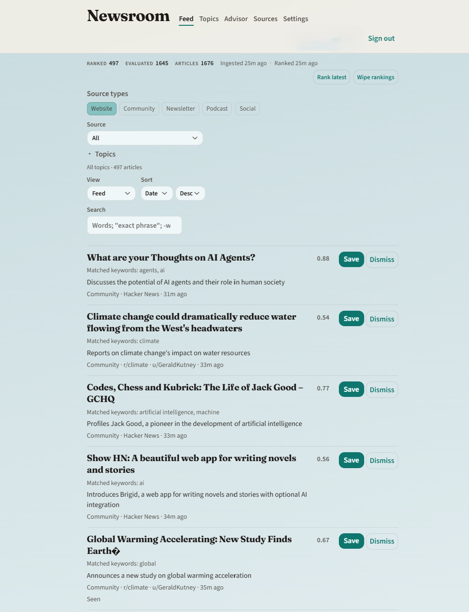

# Newsroom

**Focused news aggregator** — an aggregator of aggregators. It sits on top of Hacker News, Substack, podcasts, Bluesky, Reddit, and other personal feeds you subscribe to, then ranks stories to the topics you care about.

Instead of browsing each source separately, Newsroom pulls recent items into one hybrid-ranked feed (keywords + optional AI), with Save / Dismiss, topic filters, and an in-app Advisor for refining interests.



Personal-first; multi-user-ready data model and APIs. Web UI today; Expo mobile feed next.

## Prerequisites

- Node.js 20+
- [pnpm](https://pnpm.io) 9 (`corepack enable` recommended)
- Docker (Postgres + Ollama via Compose — `docker compose up -d`; see [docs/ops-local.md](docs/ops-local.md#ollama))
- Optional: host [Ollama](https://ollama.com) only if you want easier **GPU** access — [docs/ops-local.md](docs/ops-local.md#optional-host-install-for-gpu)

## Quick start

```bash
cp .env.example .env
cp apps/web/.env.example apps/web/.env.local
# Set BETTER_AUTH_SECRET to ≥32 characters in BOTH files, e.g. openssl rand -base64 32
# Keep shared vars (DB, Ollama, RANK_*) in sync — Next does not read root `.env`.
# See docs/ops-local.md#environment-files

pnpm install
docker compose up -d          # Postgres + Ollama (published on 127.0.0.1 only)
pnpm db:migrate
pnpm db:seed                  # demo user + HN + Platformer Substack + example topic
# First time: docker exec -it newsroom-ollama ollama pull llama3.2
pnpm --filter @newsroom/web dev
```

Open http://localhost:3000 — sign up / sign in. Default seed login after `pnpm db:seed`: **demo@example.com** / **newsroom-demo**. Authenticated home is the ranked **Feed**; use **Topics**, **Advisor**, **Sources**, and **Settings** in the masthead.

Scores are per user: after seed + ingest + rank, sign in as the seeded demo user (or run `SEED_USER_ID=<your-user-id> pnpm db:seed` then `pnpm worker:rank`, or use **Rank latest** on the Feed) to see story rows.

Check health:

```bash
curl -sS http://localhost:3000/api/health | jq
```

One-shot ingest then rank (requires migrate + seed or your own subscriptions/topics):

```bash
pnpm worker:ingest            # upserts articles; marks affected users dirty; enqueues per-user rank jobs
pnpm worker:rank              # drains rank jobs for dirty ∩ active users (feed activity in last 30m)
pnpm worker:rank -- --all-dirty  # enqueue/drain all dirty users (ignore activity gate)
pnpm worker:prune-scores      # prune stale scores + articles older than ARTICLE_TTL_DAYS (keeps saved; also runs after Rank latest)
# or: NEWSROOM_WORKER_ONCE=ingest|rank|prune-scores pnpm --filter @newsroom/worker start
```

After ingest + rank, refresh the Feed on http://localhost:3000 — story rows appear with Save / Dismiss; filter by topic, source, search, or Saved. Topic/source changes mark you dirty and clear unscored feed rows; opening the Feed records activity and enqueues catch-up rank when dirty. **Rank latest** always ranks the signed-in user. **Wipe rankings** clears `new`/`seen` scores (Saved/Dismissed stay) and does not auto re-rank.

Long-running worker (claims `ingest` and `rank` jobs; ingest cadence ~12 minutes):

```bash
pnpm --filter @newsroom/worker start
```

## Monorepo layout

| Path | Role |
|------|------|
| `apps/web` | Next.js — auth, editorial feed / topics / sources / settings UI, APIs |
| `apps/mobile` | Expo Router shell (health via api-client) |
| `apps/worker` | Postgres job poller + one-shot ingest/rank CLI |
| `packages/db` | Drizzle schema + migrations (auth, ingest, topics, scores) |
| `packages/ai` | `AiProvider` + `createAiProvider` (Ollama / OpenAI / Google) + keyword/`rankArticleBatch` helpers |
| `packages/sources` | Source adapters: HN, Substack/RSS, podcasts, Bluesky, Reddit |
| `packages/api-client` | Typed client (health, sources, topics, topic-tree, feed) |

## Commands

`make help` lists the same shortcuts. Prefer Make for day-to-day; `pnpm` / `docker compose` remain the underlying commands.

### Make targets

| Target | Description |
|--------|-------------|
| `make setup` | Copy `.env` + `apps/web/.env.local` if missing, then `pnpm install` |
| `make install` | Install workspace deps |
| `make up` | Start Postgres; Compose Ollama only if `:11434` is free (else use host Ollama) |
| `make up-postgres` | Postgres only (skip Ollama) |
| `make up-gpu` | Compose with NVIDIA GPU passthrough for Ollama |
| `make up-remote` | Same as `up` but bind Postgres/Ollama on all interfaces (`COMPOSE_HOST_BIND=0.0.0.0`) — see [ops-local](docs/ops-local.md#compose-network-binding) |
| `make down` | Stop Compose services |
| `make logs` | Tail Compose logs |
| `make migrate` | Apply Drizzle migrations |
| `make generate` | Generate Drizzle migrations from schema |
| `make seed` | Demo user + HN + Platformer Substack + example topic |
| `make studio` | Drizzle Studio |
| `make web` | Next.js dev server (:3000) |
| `make worker` | Long-running ingest + rank job poller |
| `make ingest` | One-shot ingest then exit |
| `make rank` | One-shot rank (`RANK_ARGS=-- --all-dirty` optional) |
| `make prune` | One-shot prune stale scores + old articles |
| `make test` | Compose bind assert + AI + sources unit tests (offline-safe) |
| `make assert-compose` | Assert Compose defaults Postgres/Ollama to loopback |
| `make test-ai` / `test-web` / `test-worker` / `test-sources` | Package test suites |
| `make typecheck` / `make build` | Turbo typecheck / build |
| `make ollama-pull` | Pull model into Compose Ollama (`OLLAMA_MODEL=llama3.2` default) |
| `make verify` | Local acceptance script (web must be up) |

### pnpm / Docker equivalents

| Command | Description |
|---------|-------------|
| `pnpm install` | Install workspace deps |
| `docker compose up -d` | Start Postgres + Ollama (loopback bind; see [compose network binding](docs/ops-local.md#compose-network-binding)) |
| `COMPOSE_HOST_BIND=0.0.0.0 docker compose up -d` | Publish Postgres + Ollama on all interfaces (firewall + rotate DB password first) |
| `docker compose up -d postgres` | Postgres only (skip Ollama) |
| `docker compose -f docker-compose.yml -f docker-compose.gpu.yml up -d` | Start with NVIDIA GPU passthrough for Ollama (needs NVIDIA Container Toolkit on host, see [docs/ops-local.md#gpu-with-docker-compose](docs/ops-local.md#gpu-with-docker-compose)) |
| `docker exec -it newsroom-ollama ollama pull llama3.2` | Pull ranking model into the Compose Ollama volume |
| `docker exec -it newsroom-ollama ollama pull llama3.1:8b` / `qwen2.5:7b` | Optional stronger models — better `reason` quality, slower (see [docs/ops-local.md#model-options](docs/ops-local.md#model-options)) |
| `pnpm db:generate` | Generate Drizzle migrations from schema |
| `pnpm db:migrate` | Apply migrations to `DATABASE_URL` |
| `pnpm db:seed` | Demo user + HN + Platformer Substack + `AI & infra` topic |
| `pnpm db:studio` | Drizzle Studio |
| `pnpm --filter @newsroom/web dev` / `pnpm web:dev` | Next.js dev server (:3000) |
| `pnpm --filter @newsroom/web build` / `start` | Production web build / serve |
| `pnpm --filter @newsroom/worker start` / `pnpm worker:start` | Long-running ingest + rank job poller |
| `pnpm worker:ingest` / `pnpm --filter @newsroom/worker ingest` | One-shot ingest then exit (enqueues rank) |
| `pnpm worker:rank` / `pnpm --filter @newsroom/worker rank` | One-shot rank then exit |
| `pnpm worker:prune-scores` | One-shot prune of stale scores + old articles then exit (same article GC also runs at end of each rank pass) |
| `pnpm --filter @newsroom/mobile start` / `pnpm mobile:start` | Expo dev server |
| `pnpm sources:test` | Adapter + URL normalization fixture tests |
| `pnpm worker:test` | Ingest + rank integration tests (needs Postgres; AI mocked) |
| `pnpm web:test` | Topics/feed parsers + session isolation (needs Postgres) |
| `pnpm --filter @newsroom/ai test` / `pnpm ai:test` | AI unit tests (offline-safe keyword + rank parse) |
| `pnpm --filter @newsroom/ai smoke` / `pnpm ai:smoke` | Live AI smoke via `AI_PROVIDER` (skips if unreachable; `AI_SMOKE=1` / `OLLAMA_SMOKE=1` to require it) |
| `pnpm build` / `pnpm typecheck` | Turbo build / typecheck graph |
| `./scripts/verify-scaffold.sh` | Local acceptance: health + sign-up session (web must be up) |

Env vars: see [docs/ops-local.md#environment-files](docs/ops-local.md#environment-files) for **which file** loads what. Templates: root [`.env.example`](.env.example) (worker/CLI) and [`apps/web/.env.example`](apps/web/.env.example) → `apps/web/.env.local` (Next / Rank latest). Shared: `DATABASE_URL`, `BETTER_AUTH_*`, `OLLAMA_*`, `RANK_*`, `AI_TOKEN_*`, TTLs. Web-only optional: `LANGSEARCH_API_KEY` (Sources feed search). Root-only: `GITHUB_*`, `SEED_USER_ID`, `NEWSROOM_WORKER_ONCE`. Mobile: `EXPO_PUBLIC_API_URL`. Ranking tiers: [docs/ops-local.md#ranking-model-tiers](docs/ops-local.md#ranking-model-tiers).

### Settings API (session cookie)

| Method | Path | Notes |
|--------|------|-------|
| `GET/PATCH` | `/api/settings/rank-model` | Get / set ranking model tier: `none` \| `fast` \| `standard` |
| `GET/PUT/DELETE` | `/api/settings/ai-credentials` | Optional BYOK OpenAI/Google key (encrypted; requires `AI_CREDENTIALS_KEY`) |

### Sources API (session cookie)

| Method | Path | Notes |
|--------|------|-------|
| `GET/POST` | `/api/sources` | List / create (caller’s sources only) |
| `PATCH/DELETE` | `/api/sources/:id` | Update / delete own source |
| `GET` | `/api/feed-catalog` | Curated suggested feeds |
| `POST` | `/api/feed-search` | Discover RSS/Atom URLs via LangSearch (`LANGSEARCH_API_KEY`); `{ query }` → `{ results }` |

### Topics & feed API (session cookie)

| Method | Path | Notes |
|--------|------|-------|
| `GET` | `/api/topic-tree` | Curated catalog `{ version, nodes[] }` (selectable leaves for topic names) |
| `GET/POST` | `/api/topics` | List / create (caller’s topics only; `name` = catalog leaf label) |
| `PATCH/DELETE` | `/api/topics/:id` | Update / delete own topic |
| `GET` | `/api/feed?cursor=&topic=&excludeTopic=&source=&status=&limit=` | Ranked scores; default is `new`/`seen` only; `topic=` includes (OR), `excludeTopic=` excludes; `status=saved` (etc.) filters to that status; returns `rankedCount` / `evaluatedCount` / `articlesCount` pipeline counters |
| `POST` | `/api/feed/:articleId/seen\|saved\|dismissed` | Update status; `404` if no score row |

Ranking formulas and job behavior: [docs/decisions/002-hybrid-ranking.md](docs/decisions/002-hybrid-ranking.md). Health, seed, Compose: [docs/ops-local.md](docs/ops-local.md).

## Docs

| Doc | Purpose |
|-----|---------|
| [docs/architecture.md](docs/architecture.md) | System design, data model, APIs |
| [docs/ops-local.md](docs/ops-local.md) | Local Compose / health / ingest / rank; Ollama via Compose (easy) or host (GPU) |
| [docs/decisions/001-ingest-url-and-hn.md](docs/decisions/001-ingest-url-and-hn.md) | Canonical URL + HN Firebase choices |
| [docs/decisions/002-hybrid-ranking.md](docs/decisions/002-hybrid-ranking.md) | Keyword + AI rank formulas and jobs |
| [docs/decisions/004-ai-confirmed-topic-membership.md](docs/decisions/004-ai-confirmed-topic-membership.md) | Why the feed's topic filter uses AI-narrowed, not raw keyword, matches |
| [docs/feature-backlog.md](docs/feature-backlog.md) | Feature segmentation index |
| [docs/feature-completed.md](docs/feature-completed.md) | Shipped registry |
| [docs/github-workflow.md](docs/github-workflow.md) | Issues, PRs, helper scripts |
| [docs/contributing.md](docs/contributing.md) | Contribution norms |

## Status

Core loop is shipped: auth, multi-source ingest (HN, Substack/RSS, podcasts, Bluesky, Reddit), hybrid rank + Advisor (Ollama / OpenAI / Google, optional BYOK), editorial web UI. Expo feed UI is next per the backlog.

## License

[MIT](LICENSE) © 2026 SpektrNO
