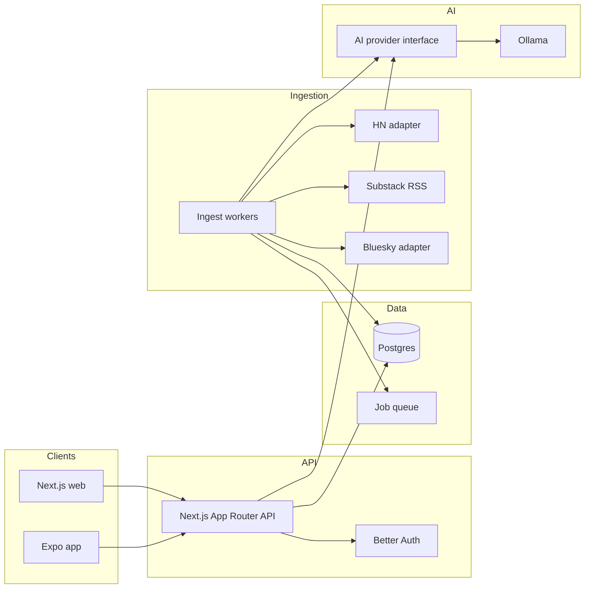

# Newsroom architecture

Personal-first, multi-user-ready feed of stories matched to topics of interest. Primary sources: Hacker News, Substack, and podcasts; Bluesky later; X deferred.

## Goals

- Hybrid relevance: keyword/tag shortlist, then Ollama ranks, dedupes, and lightly explains matches
- In-app AI advisor chat for topic/keyword guidance (planned)
- Elegant Next.js website + Expo (iOS/Android)
- Same APIs and data model for one user today and many users later

## System overview

## Monorepo layout

| Path | Role |
|------|------|
| `apps/web` | Next.js — authenticated feed, topics, sources |
| `apps/mobile` | Expo Router — feed, topic prefs, open-in-browser |
| `apps/worker` | Scheduled ingest + AI ranking jobs |
| `packages/db` | Drizzle schema + migrations |
| `packages/api-client` | Shared typed fetch client for web + mobile |
| `packages/ai` | `AiProvider` interface; `OllamaProvider` default |
| `packages/sources` | Source adapters (HN, Substack, podcasts; later Bluesky/X) |

## Defaults

- **DB:** Postgres + Drizzle
- **Auth:** Better Auth (email/password first; OAuth later) — user-scoped from day one
- **Jobs:** Postgres-backed queue (avoid Redis in v1)
- **AI:** Ollama locally; all calls via `packages/ai` so a hosted model can replace it later

## Data model

- `users`, `sessions` — Better Auth
- `articles` — canonical URL, title, summary, author, published_at, optional podcast show_title / duration_seconds / enclosure_url, raw payload, content hash
- `source_subscriptions` — `user_id`, `source_type` (`hackernews` \| `substack` \| `podcast` \| `bluesky` \| …), config JSON, enabled
- `article_sources` — which adapter produced an article
- `user_article_scores` — per-user keyword_score, ai_score, final_rank, reason, status (`new` \| `seen` \| `saved` \| `dismissed`)
- `jobs` — ingest/rank work items

Personal mode = one user row. Multi-user = same schema.

## Hybrid relevance pipeline

1. **Ingest** (~10–15 min): adapters fetch; upsert `articles` by canonical URL.
2. **Keyword pass:** match title/summary against topic keywords; drop clear misses.
3. **AI pass (Ollama):** batch shortlist; relevance 0–1, near-duplicates, one-line why; write `user_article_scores`.
4. **Feed API:** `GET /api/feed` returns ranked items for the session user.

Never call Ollama from UI code.

**Scale path (backlog B2):** Keep shared articles + per-user scores. Evolve off “one rank pass walks every user” via `rank-dirty-incremental` (shipped: dirty ∩ active) → `rank-per-user-queue` (shipped: one `jobs` row per `userId`, fair `SKIP LOCKED` dequeue) → `rank-ai-budgets` (shipped: per-run/day AI article caps + keyword-only beyond budget) → `rank-score-retention` (shipped: prune `new`/`seen`/`dismissed` by TTL + top-N; always keep `saved`; also prune shared `articles` older than `ARTICLE_TTL_DAYS` default 90 unless any user saved them). Cadence: mark users dirty on ingest/preference change; enqueue AI rank for **dirty ∩ active** (recent feed activity, not merely a session cookie); catch-up on feed load when dirty; coalesce **per user** (unique open rank job on `payload.userId`). Hosted AI provider swap stays under `multiuser-harden`.

**Token metering (`ai-token-metering`):** Every `AiProvider.complete` reports usage (Ollama `prompt_eval_count`/`eval_count`, else chars/4 estimated). Daily per-user rollups in `ai_token_daily` by purpose (`rank`/`chat`/`other`). Settings shows used vs `AI_TOKEN_DAILY_LIMIT` (soft warn via `AI_TOKEN_DAILY_SOFT_LIMIT`, default 80%). Shared pool: chat over hard → `429 token_budget_exceeded`; rank skips further AI batches (keyword-only). `GET /api/ai-usage` for the session user (includes `rankAi` article caps from `rank-ai-budgets`: `RANK_AI_MAX_PER_RUN` / `RANK_AI_MAX_PER_DAY` / optional global).

## Source adapters

| Source | Approach | Status |
|--------|----------|--------|
| Hacker News | Firebase API + Algolia HN Search | v1 |
| Substack | User-added RSS URLs + curated catalog (`web-source-discovery`) | v1 |
| Podcasts | Podcast RSS/Atom (`source_type: podcast`, `{ rssUrl }`); episodes as feed items with show/duration/enclosure | v1 (`source-podcast`) |
| Bluesky | AT Proto public endpoints | later (`source-bluesky`) |
| X | Paid API | deferred |

Contract: `fetchRecent() → NormalizedArticle[]`. Config in `source_subscriptions.config`.

## API surface

- `POST /api/auth/*` — Better Auth
- `GET /api/topic-tree` — curated hierarchical topic catalog (session; static v1)
- `GET/POST/PATCH/DELETE /api/topics` — topic CRUD; `name` must be a selectable catalog leaf label
- `GET/POST/DELETE /api/sources`
- `GET /api/feed-catalog` — curated RSS feed catalog (session; static v1)
- `GET /api/feed?cursor=&topic=&source=&status=`
- `POST /api/feed/rank` — session; run keyword + AI rank for the current user only (may take minutes)
- `POST /api/feed/:id/seen|saved|dismissed`
- `GET /api/ai-usage` — session; today’s token rollup vs daily limits
- `POST /api/chat` — session chat for topic/keyword advice via `AiProvider` (`web-ai-advisor-chat`); may return `tokens` / `aiUsage`; `429 token_budget_exceeded` when over daily hard cap
- `GET /api/health` — includes Ollama reachability

## Clients

**Web:** feed home, topics, advisor chat, sources, settings. Calm editorial UI — restrained typography, soft atmospheric background, no dashboard card wall. Topics page (`web-topics-tree` + `web-topics-catalog`): curated topic-tree picker (leaf label stored in `topics.name`); free-text keyword chips (case-insensitive match); in-UI weight help tied to hybrid ranking (ADR 002); Catalog browse of the full curated tree with Following vs Available and one-click Follow (`POST /api/topics` with starter keywords). **Advisor** (`/chat`, `web-ai-advisor-chat`): in-app chat for topic/keyword suggestions via BFF → `AiProvider` (never from the browser); confirm before Follow / Add keywords. **Sources** (`web-source-discovery` + `source-podcast`): curated newsletter catalog (`GET /api/feed-catalog`) with one-click Add feed alongside manual RSS URL entry; distinct **Add podcast** for `source_type: podcast` RSS/Atom (catalog podcast entries are a follow-up). HN remains the shared firehose. Podcast episodes appear in the ranked feed with show/duration meta and external Play audio (no in-app player). **Settings** shows today’s AI token usage vs daily limit (`ai-token-metering`).

**Mobile (Expo):** Feed / Topics / Sources tabs; open originals in system or in-app browser; same auth backend.

## Local development

- Docker Compose: Postgres (+ optional Ollama container or host Ollama)
- Env: `DATABASE_URL`, `OLLAMA_HOST`, model name, Better Auth secrets
- Seed: first user + example topics + one Substack feed

## Out of scope (MVP)

- Full-text paywalled Substack bodies
- Social posting
- Native X without approved API access
- Heavy ML beyond hybrid keyword + Ollama ranking
