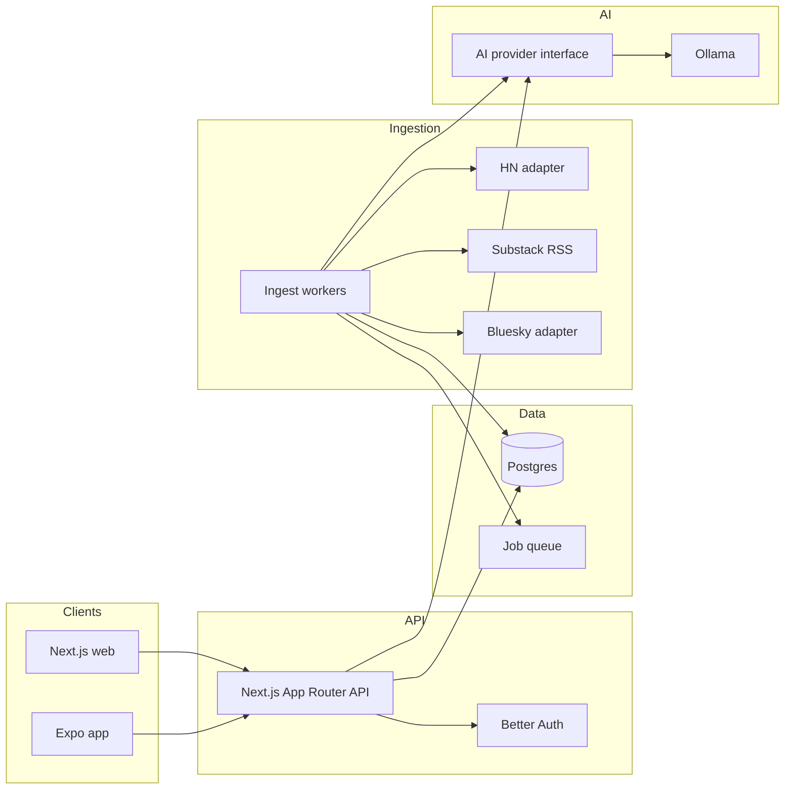

# Newsroom architecture

Personal-first, multi-user-ready feed of stories matched to topics of interest. Primary sources: Hacker News and Substack; Bluesky later; X deferred.

## Goals

- Hybrid relevance: keyword/tag shortlist, then Ollama ranks, dedupes, and lightly explains matches
- Elegant Next.js website + Expo (iOS/Android)
- Same APIs and data model for one user today and many users later

## System overview

## Monorepo layout

| Path | Role |
|------|------|
| `apps/web` | Next.js — authenticated feed, topics, sources |
| `apps/mobile` | Expo Router — feed, topic prefs, open-in-browser |
| `apps/worker` | Scheduled ingest + AI ranking jobs |
| `packages/db` | Drizzle schema + migrations |
| `packages/api-client` | Shared typed fetch client for web + mobile |
| `packages/ai` | `AiProvider` interface; `OllamaProvider` default |
| `packages/sources` | Source adapters (HN, Substack, later Bluesky/X) |

## Defaults

- **DB:** Postgres + Drizzle
- **Auth:** Better Auth (email/password first; OAuth later) — user-scoped from day one
- **Jobs:** Postgres-backed queue (avoid Redis in v1)
- **AI:** Ollama locally; all calls via `packages/ai` so a hosted model can replace it later

## Data model

- `users`, `sessions` — Better Auth
- `topics` — `user_id`, name, keywords[], weight, enabled
- `source_subscriptions` — `user_id`, `source_type` (`hackernews` \| `substack` \| `bluesky` \| …), config JSON, enabled
- `articles` — canonical URL, title, summary, author, published_at, raw payload, content hash
- `article_sources` — which adapter produced an article
- `user_article_scores` — per-user keyword_score, ai_score, final_rank, reason, status (`new` \| `seen` \| `saved` \| `dismissed`)
- `jobs` — ingest/rank work items

Personal mode = one user row. Multi-user = same schema.

## Hybrid relevance pipeline

1. **Ingest** (~10–15 min): adapters fetch; upsert `articles` by canonical URL.
2. **Keyword pass:** match title/summary against topic keywords; drop clear misses.
3. **AI pass (Ollama):** batch shortlist; relevance 0–1, near-duplicates, one-line why; write `user_article_scores`.
4. **Feed API:** `GET /api/feed` returns ranked items for the session user.

Never call Ollama from UI code.

**Scale path (backlog B2):** Keep shared articles + per-user scores. Evolve off “one rank pass walks every user” via `rank-dirty-incremental` → `rank-per-user-queue` → `rank-ai-budgets` → `rank-score-retention` (see `docs/feature-backlog.md`). Hosted AI provider swap stays under `multiuser-harden`.

## Source adapters

| Source | Approach | Status |
|--------|----------|--------|
| Hacker News | Firebase API + Algolia HN Search | v1 |
| Substack | User-added RSS URLs | v1 |
| Bluesky | AT Proto public endpoints | later (`source-bluesky`) |
| X | Paid API | deferred |

Contract: `fetchRecent() → NormalizedArticle[]`. Config in `source_subscriptions.config`.

## API surface

- `POST /api/auth/*` — Better Auth
- `GET /api/topic-tree` — curated hierarchical topic catalog (session; static v1)
- `GET/POST/PATCH/DELETE /api/topics` — topic CRUD; `name` must be a selectable catalog leaf label
- `GET/POST/DELETE /api/sources`
- `GET /api/feed?cursor=&topic=&source=&status=`
- `POST /api/feed/:id/seen|saved|dismissed`
- `GET /api/health` — includes Ollama reachability

## Clients

**Web:** feed home, topics, sources, settings. Calm editorial UI — restrained typography, soft atmospheric background, no dashboard card wall. Topics page (`web-topics-tree` + `web-topics-catalog`): curated topic-tree picker (leaf label stored in `topics.name`); free-text keyword chips (case-insensitive match); in-UI weight help tied to hybrid ranking (ADR 002); Catalog browse of the full curated tree with Following vs Available and one-click Follow (`POST /api/topics` with starter keywords).

**Mobile (Expo):** Feed / Topics / Sources tabs; open originals in system or in-app browser; same auth backend.

## Local development

- Docker Compose: Postgres (+ optional Ollama container or host Ollama)
- Env: `DATABASE_URL`, `OLLAMA_HOST`, model name, Better Auth secrets
- Seed: first user + example topics + one Substack feed

## Out of scope (MVP)

- Full-text paywalled Substack bodies
- Social posting
- Native X without approved API access
- Heavy ML beyond hybrid keyword + Ollama ranking
