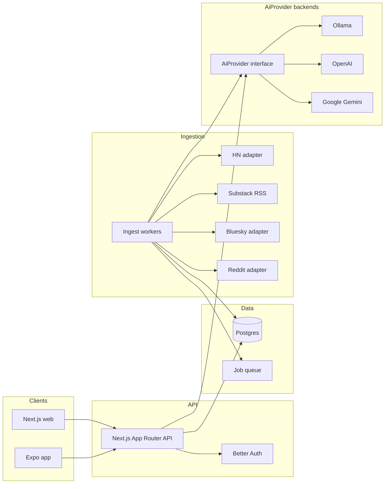

# Newsroom architecture

Personal-first, multi-user-ready feed of stories matched to topics of interest. Sources are categorized as websites, communities (HN, Reddit, Substack/dev.to-style RSS, …), podcasts, and social media (Bluesky; X deferred).

## Goals

- Hybrid relevance: keyword/tag shortlist, then an `AiProvider` ranks, dedupes, and lightly explains matches
- In-app AI advisor chat for topic/keyword guidance (via the same `AiProvider`)
- Elegant Next.js website + Expo (iOS/Android)
- Same APIs and data model for one user today and many users later

## System overview

**`AiProvider` is the only AI boundary.** Worker rank and the web BFF (`/api/chat`, Rank latest, health) call `complete` / `health` through `packages/ai`. **Ollama is one concrete implementation** (default for local deploys via `AI_PROVIDER=ollama`). OpenAI and Google Gemini are peer implementations behind the same interface (`createAiProvider` / optional per-user BYOK). New vendors plug in as another `AiProvider` without changing rank/advisor prompts. UI never talks to any model host directly.

## Monorepo layout

| Path | Role |
|------|------|
| `apps/web` | Next.js — authenticated feed, topics, sources |
| `apps/mobile` | Expo Router — feed, topic prefs, open-in-browser |
| `apps/worker` | Scheduled ingest + AI ranking jobs |
| `packages/db` | Drizzle schema + migrations |
| `packages/api-client` | Shared typed fetch client for web + mobile |
| `packages/ai` | `AiProvider` interface; `createAiProvider` → Ollama (default) / OpenAI / Google |
| `packages/sources` | Source adapters (`hackernews`, `rss`, `bluesky`, `reddit`) + category helpers |

## Defaults

- **DB:** Postgres + Drizzle
- **Auth:** Better Auth (email/password first; OAuth later) — user-scoped from day one
- **Jobs:** Postgres-backed queue (avoid Redis in v1)
- **AI:** `AiProvider` in `packages/ai`. Default local backend is **Ollama**; hosted OpenAI/Google (and optional BYOK) are alternate implementations of the same interface — not a special path around it.

## Data model

- `users`, `sessions` — Better Auth
- `articles` — canonical URL, title, summary, author, published_at, optional podcast show_title / duration_seconds / enclosure_url, raw payload, content hash
- `source_subscriptions` — `user_id`, **`category`** (`podcast` \| `website` \| `social_media` \| `community` \| `newsletter`), **`adapter`** (`hackernews` \| `rss` \| `bluesky` \| `reddit`), config JSON, enabled
- `article_sources` — which category/adapter produced an article (denormalized at ingest)
- `user_article_scores` — per-user keyword_score, ai_score, final_rank, reason, status (`new` \| `seen` \| `saved` \| `dismissed`), matched_topic_ids (topic ids the article belongs to — keyword-matched, then AI-narrowed; `NULL` on pre-migration rows)
- `user_article_evaluations` — per-user keyword check markers (`hit` true/false); lets rank walk past misses without polluting the feed score table
- `jobs` — ingest/rank work items

Personal mode = one user row. Multi-user = same schema.

## Hybrid relevance pipeline

1. **Ingest** (~10–15 min): adapters fetch; upsert `articles` by canonical URL.
2. **Keyword pass:** match title/summary against topic keywords; write `user_article_evaluations` for every checked article (hit or miss). Only hits get a `user_article_scores` row.
3. **AI pass (`AiProvider`):** batch shortlist; relevance 0–1, near-duplicates, one-line why, and per-article `confirmedTopicIds` (subset of its keyword-matched topics the model believes it's genuinely about — narrows, never adds); update `user_article_scores`. Backend is whatever `createAiProvider` / BYOK resolves (Ollama, OpenAI, or Google — same prompt contract). Each user picks a persisted **rank model tier** (`user.rank_model_tier`): `none` skips this step entirely (keyword-only, no AI budget spent), `fast` / `standard` map to model ids via `RANK_MODEL_*` and provider-aware defaults (ADR 005). Settings: `GET/PATCH /api/settings/rank-model`.
4. **Feed API:** `GET /api/feed` returns ranked items for the session user, plus pipeline counts `rankedCount` / `evaluatedCount` / `articlesCount` (score rows / keyword checks / distinct articles from enabled sources). Timestamps: `lastIngestAt` is the last completed ingest job; `lastRankedAt` is the last completed **rank job** for that user (so a pass with evaluations but no new score rows still advances “Ranked … ago”), falling back to `max(scored_at)` when no completed rank jobs remain. All three counts use the same age window as article GC (`ARTICLE_TTL_DAYS`, default 90; `0` = off) — feed list and rank candidates share that cutoff via `feedMaxAgeCutoff()`. Ranked is keyword hits (score rows) — AI scoring updates existing rows and does not raise Ranked. After each rank pass, score TTL prune runs per user and **article prune** runs once for the shared corpus (same as `pnpm worker:prune-scores`). The `topic=` filter checks the stored `matched_topic_ids` (AI-narrowed) rather than re-deriving membership from raw keywords; pre-migration rows (`NULL`) fall back to a live keyword re-check (`ai-confirmed-topic-membership`, ADR 004).

**Multi-user retention caveat:** Score prune is per-user (`new`/`seen`/`dismissed` by TTL/top-N; that user’s `saved` kept). Article GC is **shared**: deleting an old article cascades away every user’s scores and evaluations on it unless **any** user has it `saved`. So one user’s rank/prune pass can drop another user’s unranked-or-ranked-but-unsaved rows for that story; pipeline counts and feeds for idle users can jump down without those users ranking. Acceptable for v1 personal/small multi-user; tighter per-user article lifetime (or “keep while any score exists”) stays under `multiuser-harden` if needed.

Never call model hosts (Ollama, OpenAI, Google, …) from UI code — only via BFF/worker → `AiProvider`.

**Candidate selection:** Prefer never-evaluated articles, then stale (content `updated_at` newer than evaluation), then recency. Skip fresh keyword misses and fully AI-scored hits. Cap ~200 per user per run so consecutive ranks advance through the corpus. Ingest only bumps article `updated_at` when `content_hash` changes, so re-fetching the same story does not stale evaluations. Preference dirty (topic add/edit/delete) clears **miss** evaluations only and marks the user dirty — scored hits and hit evaluations stay so the feed is not wiped; earlier misses can still become hits under new keywords.

**Scale path (backlog B2):** Keep shared articles + per-user scores (+ evaluation markers). Evolve off “one rank pass walks every user” via `rank-dirty-incremental` (shipped: dirty ∩ active) → `rank-per-user-queue` (shipped: one `jobs` row per `userId`, fair `SKIP LOCKED` dequeue) → `rank-ai-budgets` (shipped: per-run/day AI article caps + keyword-only beyond budget) → `rank-score-retention` (shipped: prune `new`/`seen`/`dismissed` by TTL + top-N; always keep `saved`; also prune shared `articles` older than `ARTICLE_TTL_DAYS` default 90 unless any user saved them; evaluations prune on the same TTL). Cadence: mark users dirty on ingest/preference change; enqueue AI rank for **dirty ∩ active** (recent feed activity, not merely a session cookie); catch-up on feed load when dirty; coalesce **per user** (unique open rank job on `payload.userId`). Hosted backends are peer `AiProvider`s (`ai-cloud-providers`, shipped); per-user keys via `ai-cloud-providers-byok`.

**Token metering (`ai-token-metering`):** Every `AiProvider.complete` reports usage (Ollama `prompt_eval_count`/`eval_count`, OpenAI `usage`, Google `usageMetadata`, else chars/4 estimated). Daily per-user rollups in `ai_token_daily` by purpose (`rank`/`chat`/`other`). Settings shows used vs `AI_TOKEN_DAILY_LIMIT` (soft warn via `AI_TOKEN_DAILY_SOFT_LIMIT`, default 80%). Shared pool: chat over hard → `429 token_budget_exceeded`; rank skips further AI batches (keyword-only). Article caps from `rank-ai-budgets`: `RANK_AI_MAX_PER_RUN` (default 60, bounds one Rank latest), `RANK_AI_MAX_PER_DAY` (default **0 = unlimited** — daily cost is the token cap), optional `RANK_AI_MAX_GLOBAL_PER_DAY`. `GET /api/ai-usage` exposes both token and article status for the session user.

**Cloud / local backends (`ai-cloud-providers`):** `AI_PROVIDER=ollama|openai|google` selects which **implementation** of `AiProvider` the factory builds (default `ollama`). Same contract for rank and Advisor. **BYOK** (`ai-cloud-providers-byok`): optional per-user encrypted OpenAI/Google key in Settings (`AI_CREDENTIALS_KEY`); rank/chat prefer that user’s provider when set — still through `AiProvider`, never from the browser.

## Source adapters

Subscriptions have a product **category** (feed filters / Sources UI) and an ingest **adapter** (fetch implementation). Examples (HN, Substack, Bluesky) are not top-level types.

| Category | Typical adapters | Notes |
|----------|------------------|--------|
| `community` | `hackernews`, `reddit`, `rss` | HN, Reddit, Substack/dev.to-style RSS, etc. |
| `website` | `rss` | Magazines, newspapers, independent blogs |
| `newsletter` | `rss` | Digests / email-style publications (TLDR, Bytes, …) |
| `podcast` | `rss` | Enclosure-aware RSS parse |
| `social_media` | `bluesky` | Follow a handle (X/FB later) |

| Adapter | Approach | Status |
|---------|----------|--------|
| `hackernews` | Firebase `topstories` + `newstories`; OP first comment → summary when no story body | v1 |
| `rss` | Generic RSS/Atom (`{ rssUrl }`); podcast category adds show/duration/enclosure | v1 |
| `bluesky` | Public AppView `getAuthorFeed` (`{ handle }`) | v1 |
| `reddit` | Subreddit listing (`{ subreddit }`); OAuth JSON when creds set, else public JSON / RSS fallback | v1 |
| X / Facebook | Paid / restricted APIs | deferred |

Contract: `fetchRecent() → NormalizedArticle[]`. Config in `source_subscriptions.config`. Curated catalog shelves match categories 1:1 (Websites, Communities, Newsletters, Podcasts, Social).

## API surface

- `POST /api/auth/*` — Better Auth
- `GET /api/topic-tree` — curated hierarchical topic catalog (session; static v1)
- `GET/POST/PATCH/DELETE /api/topics` — topic CRUD; `name` must be a selectable catalog leaf label
- `GET/POST/DELETE /api/sources`
- `GET /api/feed-catalog` — curated RSS feed catalog (session; static v1)
- `POST /api/feed-search` — session; discover RSS/Atom URLs via LangSearch (`LANGSEARCH_API_KEY`); browser never calls LangSearch
- `GET /api/feed?cursor=&topic=&excludeTopic=&source=&sourceId=&status=`
- `POST /api/feed/rank` — session; run keyword + AI rank for the current user only (may take minutes)
- `POST /api/feed/wipe-rankings` — session; delete `new`/`seen` scores (+ orphan evaluations); keep saved/dismissed; clear dirty (no auto re-rank)
- `GET/PATCH /api/settings/rank-model` — session; get/set the caller's rank model tier (`none` \| `fast` \| `standard`); PATCH marks preferences dirty
- `GET/PUT/DELETE /api/settings/ai-credentials` — session; optional BYOK OpenAI/Google key (encrypted; `AI_CREDENTIALS_KEY`)
- `POST /api/feed/:id/seen|saved|dismissed`
- `GET /api/ai-usage` — session; today’s token rollup vs daily limits
- `POST /api/chat` — session chat for topic/keyword advice via `AiProvider` (`web-ai-advisor-chat`); may return `tokens` / `aiUsage`; `429 token_budget_exceeded` when over daily hard cap
- `GET /api/health` — DB + configured `AiProvider` reachability (`checks.ai`; `aiProvider` name)

## Clients

**Web:** feed home, topics, advisor chat, sources, settings. Calm editorial UI — restrained typography, soft atmospheric background, no dashboard card wall. Topics page (`web-topics-tree` + `web-topics-catalog`): curated topic-tree picker (leaf label stored in `topics.name`); free-text keyword chips (case-insensitive match); in-UI weight help tied to hybrid ranking (ADR 002); Catalog browse of the full curated tree with Following vs Available and one-click Follow (`POST /api/topics` with starter keywords). **Advisor** (`/chat`, `web-ai-advisor-chat`): in-app chat for topic/keyword suggestions via BFF → `AiProvider` (never from the browser); confirm before Follow / Add keywords. **Sources** (`web-source-discovery` + `web-source-feed-search` + `source-podcast` + `source-bluesky` + `source-reddit`): curated newsletter catalog (`GET /api/feed-catalog`) with one-click Add feed alongside manual RSS URL entry; **Find a feed** search (`POST /api/feed-search` → LangSearch) for RSS-capable Add kinds; podcast / Bluesky / Reddit via the unified Add a source control (`rssUrl` / `handle` / `subreddit`); HN remains the shared firehose. Podcast episodes appear in the ranked feed with show/duration meta and external Play audio (no in-app player). Bluesky posts appear with author meta and open on bsky.app. Reddit posts show `r/{sub}` + author and open on reddit.com. Feed toolbar **Wipe rankings** (`wipe-rankings`) clears `new`/`seen` scores (keeps Saved/Dismissed; no auto re-rank). **Settings** shows today’s AI token usage vs daily limit (`ai-token-metering`). **Appearance** (`introduce-themes`): Settings background presets (`data-theme`: paper / mist / slate / inkwash) and Comfortable/Compact density (`data-density`) apply on `<html>` via CSS tokens; persisted in browser `localStorage` only (no API/DB); FOUC boot script in root layout — see ADR 003 addendum.

**Mobile (Expo):** Feed / Topics / Sources tabs; open originals in system or in-app browser; same auth backend.

## Local development

- Docker Compose: Postgres (+ optional Ollama when using the default `AiProvider` backend)
- Env: `DATABASE_URL`, `AI_PROVIDER` (+ backend keys / `OLLAMA_*`), Better Auth secrets; optional `AI_CREDENTIALS_KEY` for BYOK
- Seed: first user + example topics + one Substack feed

## Out of scope (MVP)

- Full-text paywalled Substack bodies
- Social posting
- Native X without approved API access
- Heavy ML beyond hybrid keyword + `AiProvider` ranking
